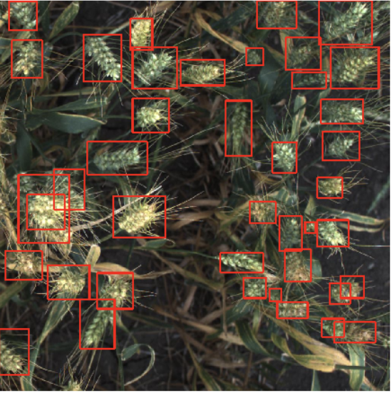

# GLOBAL WHEAT DETECTION

## CONTRIBUTORS
  - Akanksha .
  - Aakanksha Nallabothula Surya

## TECHNOLOGIES USED:
  - PyTorch
  - Deep Learning - Faster-RCNN

## GOAL
To predict bounding boxes around each wheat head in images that have them.

Kaggle competition link: https://www.kaggle.com/c/global-wheat-detection
  
## DATA
Training data consists of 3422 image files, totaling around 613 Mb.
Train.csv has columns such as image_id, width and height of the image, and bounding box dimension [xmin, ymin, width, height]

## FINAL REPORT
https://github.com/aakanksha-ns/wheat-detection/blob/master/Deep_Learning_Project_Report.pdf

## CODE
Exploratory Data Analysis:  
https://github.com/aakanksha-ns/wheat-detection/blob/master/Wheat_Detection_EDA.ipynb

Faster RCNN attempt 1:  
https://github.com/aakanksha-ns/wheat-detection/blob/master/FasterRCNN_attempt1.ipynb

Final Training notebook:  
https://github.com/aakanksha-ns/wheat-detection/blob/master/faster_r-CNN_resnet152_train.ipynb

Final Inference notebook:  
https://github.com/aakanksha-ns/wheat-detection/blob/master/faster_r-CNN_Inference.ipynb
